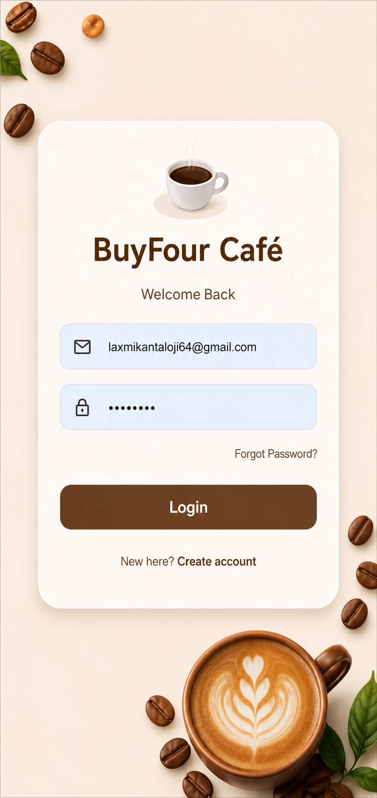

# BuyFour - Coffee Shop Management System

## Overview

BuyFour is a full-stack Coffee Shop Management System developed using React JS, Spring Boot, Spring Security, JPA, Hibernate, MySQL, and REST APIs.

The application provides a complete coffee shop management solution where users can browse products, manage carts, place orders, maintain favorite products, manage categories, upload profile images, and securely authenticate using Spring Security.

The project follows modern enterprise application architecture with frontend-backend integration through REST APIs.

---

## 🖼️ Application Screenshots

### Login Page



---

### Customer Dashboard


---

### Product Details


---

### Shopping Cart


---

### Category Management


---

### Coffee Product Management


---

### Dessert Product Management


---

### Order Bill / Invoice


---


---

## Features

### Authentication & User Management

* User Registration
* User Login & Logout
* Email Validation
* Forgot Password
* OTP Verification
* Password Reset
* Spring Security Authentication
* Profile Management
* Profile Image Upload
* Profile Image Update
* Profile Image Delete

### Product Management

* Add Products
* Update Products
* Delete Products
* View Products
* Product Search
* Product Filtering
* Category-wise Product Listing
* Product Image Upload

### Category Management

* Add Categories
* Update Categories
* Delete Categories
* View Categories

### Shopping Cart Management

* Add Products to Cart
* Update Cart Quantity
* Remove Cart Items
* Clear Cart
* View User Cart

### Order Management

* Place Orders
* Generate Order Bills


### Favorite Products

* Add Favorite Products
* View Favorite Products
* Remove Favorite Products

---

## Technology Stack

### Frontend

* React JS
* Axios
* HTML
* CSS

### Backend

* Java
* Spring Boot
* Spring Framework
* Spring Security
* Spring Data JPA
* Hibernate
* REST APIs

### Database

* MySQL

### Tools

* IntelliJ IDEA
* VS Code
* Maven
* GitHub

---

## Project Architecture

```text
React JS Frontend
        ↓
REST APIs
        ↓
Spring Boot Controllers
        ↓
Service Layer
        ↓
Repository Layer
        ↓
MySQL Database
```

---

## Modules

* Authentication Module
* User Management Module
* Product Management Module
* Category Management Module
* Cart Management Module
* Order Management Module
* Favorite Products Module
* Profile Management Module

---

## Learning Outcomes

* Spring Boot Application Development
* Spring Security Implementation
* REST API Development
* JPA & Hibernate ORM
* MySQL Database Integration
* React JS Frontend Development
* Authentication & Authorization
* File Upload Handling
* Full Stack Application Development

---

## Developed By

### Laxmikant Kshemaling

Software Engineer

### Connect With Me

LinkedIn:
https://www.linkedin.com/in/laxmikant-aloji-736200266/

GitHub:
https://github.com/LaxmikantKshemaling

Email:
[laxmikantaloji77@gmail.com](mailto:laxmikantaloji77@gmail.com)

---

## Project Status

**Version:** 1.0

**Status:** Completed ✅
